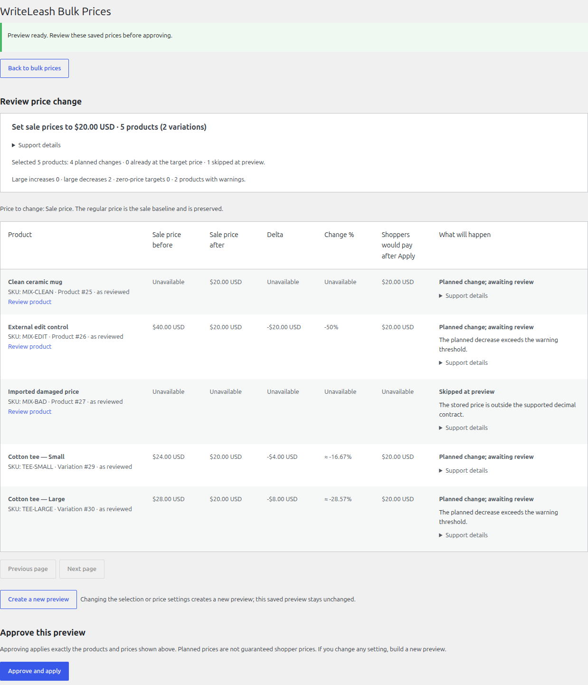
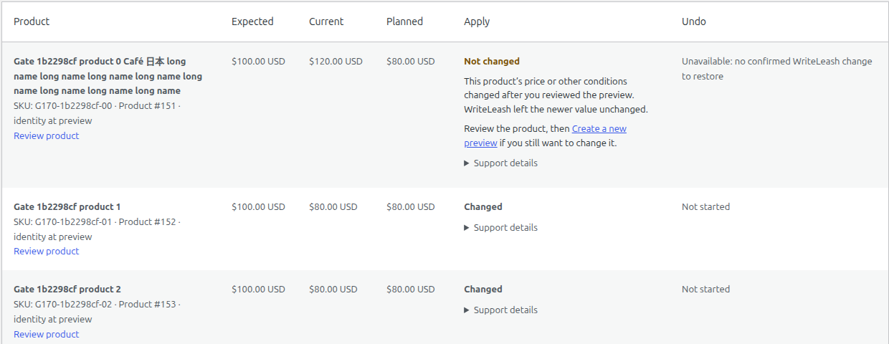
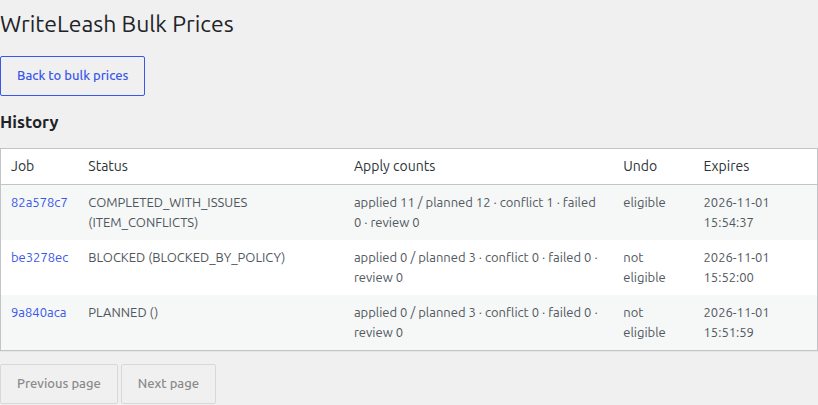

# WriteLeash for WooCommerce

**Bulk price changes without blindly overwriting newer edits.**

WriteLeash helps store owners, Shop Managers, catalog operators and agencies
update Regular Price or Sale Price across simple products and variable-product
variations. Select by product name, SKU or category, then Preview the exact
before/after prices for up to **1,000 products in one job**.

Apply the Preview you reviewed. Work runs in the background; if a relevant
price or checked product setting changed after Preview, WriteLeash preserves
the newer edit and marks that item as a conflict. Items with invalid prices or
unsupported settings show a reason and are skipped while clean work continues
where safe. Resume interrupted work, review results in History, and Undo
eligible changes when the current product state still allows restoration.

## Install and use

1. Install and activate WooCommerce within the [supported versions](wordpress/writeleash/readme.txt).
2. Install and activate the WriteLeash plugin ZIP.
3. Open **Products → Bulk Prices**.
4. Select products, choose Regular Price or Sale Price, and Preview the change.
5. Review exact prices and warnings, then approve and Apply. Use Resume if work
   is interrupted; review History and eligible Undo afterward.

For installation requirements, supported price operations and limitations, see
[the plugin listing](wordpress/writeleash/readme.txt). This repository is
preparing the public plugin submission; it does not announce a WordPress.org
listing or a published download. Plugin source is in
[`wordpress/writeleash/`](wordpress/writeleash/).

WriteLeash changes prices, not stock, orders or sale dates. Selecting a variable
parent targets its variations; you can also select individual variations.
Undo is conditional: a later relevant edit is preserved rather than overwritten.
Multisite is unsupported. Managed and shared hosting have not been tested.

## See the workflow

These static screenshots show real product screens with sample products.

**Preview exact before/after prices before approving.**

**Preserve a newer edit and see why that item was skipped.**

**Review History and which changes are eligible for Undo.**

These examples show Regular Price and Sale Price changes. Sale Price changes and variations
are supported as described in [the plugin listing](wordpress/writeleash/readme.txt).

## Contributing and security

For source changes and existing checks, read [CONTRIBUTING.md](CONTRIBUTING.md).
Report suspected vulnerabilities privately as described in
[SECURITY.md](SECURITY.md). Use [GitHub issues](https://github.com/MrDarkRoot/WriteLeash/issues)
for non-sensitive questions and bug reports, without customer data or secrets.

The WordPress plugin is **GPL-2.0-or-later**; see its
[license](wordpress/writeleash/LICENSE). The rest of the repository has no
selected repository-wide open-source license; see
[repository license status](LICENSE-TODO.md).

## Historical research

**HISTORICAL / SUPERSEDED — product identity.** The earlier PostgreSQL/native
mutation-budget research and advanced WordPress Guard/Doctor/Redirection work
remain available as technical research, separate from the WooCommerce plugin.
See the [preserved PostgreSQL overview and local demos](docs/postgresql-research.md),
[research thesis](docs/product.md), [research support matrix](docs/support-matrix.md),
and [advanced WordPress research documentation](wordpress/writeleash/README.md).
